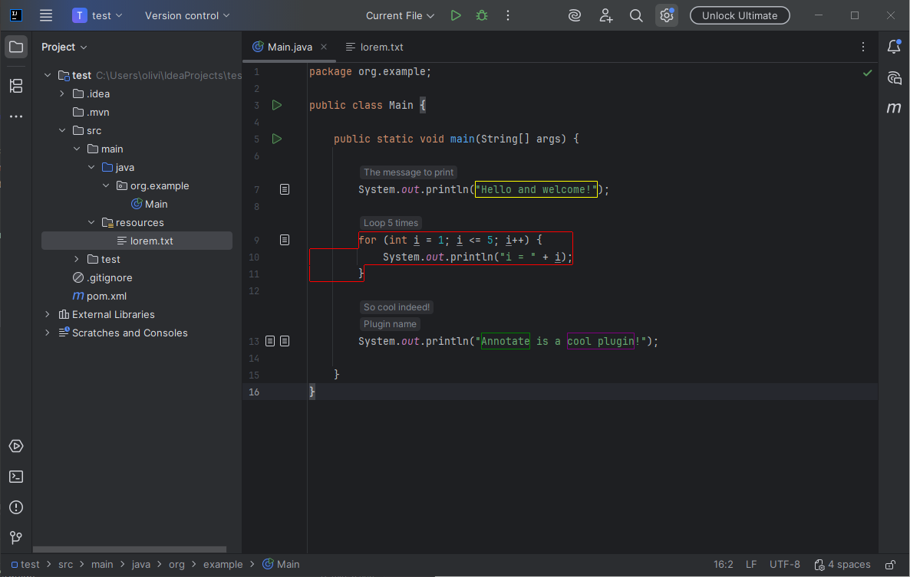
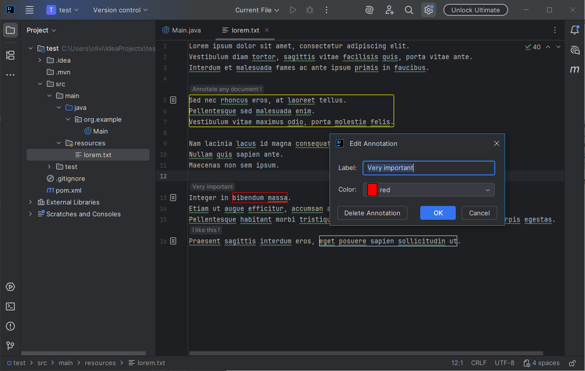

# Annotate

This plugin allows to select text in any text-based editor, and annotate it with a colorful border and a label. 

This is useful to draw attention to particular sections of the document or class, for example during training sessions or code reviews. This could also be used to leave tips or notes to future readers.

Actions are provided to add an Annotation, to edit an existing annotation, and to delete a specific annotation, all annotations in the current editor, or all annotations in the project.

###  Screen captures

### Repository 

This plugin is open-source, under MIT license. \
Repository: [https://github.com/OlivierCroisier/IJ-Annotate/](https://github.com/OlivierCroisier/IJ-Annotate/)

If you use it, I'd love to hear from you ! Tell me how it was useful to you ? \
Also, as this is my first plugin, all contributions and improvements are more than welcome :)

### Privacy & Personal Data

The plugin is 100% local and does not collect any data, personal or otherwise. The annotations are saved locally in your project's metadata.
